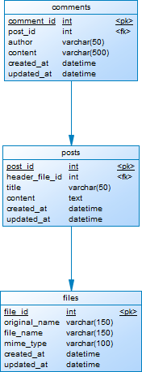

# Blog MVP

This is a simple blog MVP project. It handles blog posts and comments through REST APIs. It uses the following technologies:

- NodeJS.
- TypeScript.
- ExpressJS.
- MySQL.

Please, take a look at this diagram to better understand how it works.



Also, please take a moment to look at the [CHANGELOG](CHANGELOG.md) to better understand the versioning of this project.

## Quick Start 🚀

Please, ensure that you have installed these software in your local computer before start:

- NodeJS.
- NPM.
- Yarn.
- MySQL.

Then, follow these steps to make it work:

1. Create the Database.
    - Create two new databases in your MySQL instance: `blog_mvp` and `blog_mvp_test`. 
    - Run the file located at `database/dump.sql` in both.
2. Clone and install the project.
    - Clone this repository in your local computer.
        ```bash
        $ git clone <git-repository-url>
        ```
    - Install the project dependencies.
        ```
        $ yarn
        ```
3. Set your environment variables.
    - Create two copys of `.env.example` at the root of the folder: One must be named `.env.development` and the other `.env.test`.
    - Modify both files replacing the example values with your real values.
4. Run the project.
    ```
    $ yarn start:dev
    ```

## Interacting with the project

Once running, REST APIs will be available through `http://localhost:3000` (Port may vary according with your `.env` configuration).

Please, go to [http://localhost:3000/docs](http://localhost:3000/docs) to see the **Swagger documentation**.

## Testing

This project uses `Jest` for Unit Testing. Please, use the following command to run available tests:
```
$ yarn test
```

## Contact

Please, don't hesitate in contact me through [my GitHub account](https://github.com/AxelLR992) if you have any question about this project.